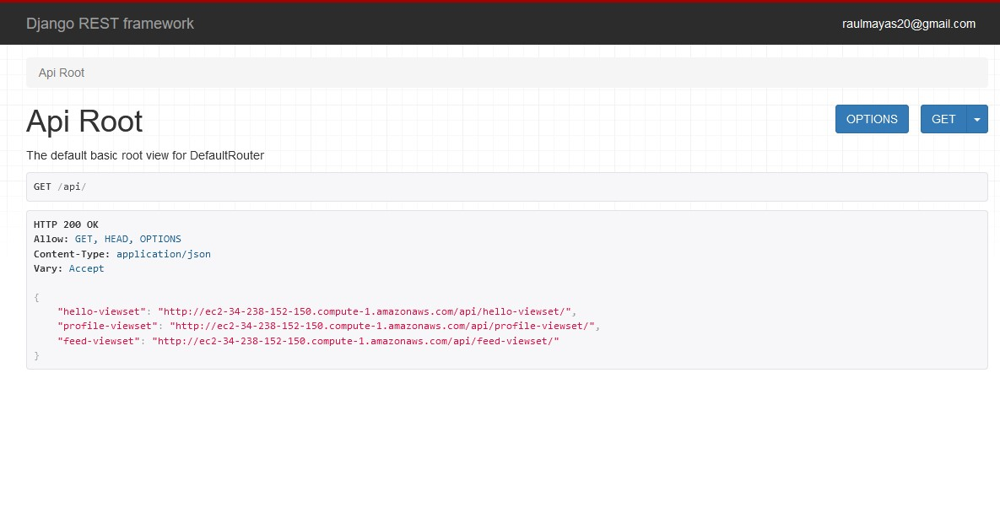

<!-- PROJECT LOGO -->
 

  

  <h2 align="center">Creating a API with Django</h2>
  <h4 align="center">DJANGO REST FRAMEWORK</h4>

  

This project is dedicated to develop an API with Django REST Framework. This API consists in basic concepts about creatin an API such as user authentication, login, creating and updating users, posting status updates, and viewing those status.
     
     
    <a href="https://github.com/RaulMaya/Profiles-Rest-API">Repository</a>    
    ·
    <a href="http://ec2-34-238-152-150.compute-1.amazonaws.com/api/">API Access</a>
    ·
    <a href="https://www.linkedin.com/in/raul-maya/">My LinkedIn</a>

  

<!-- ABOUT THE PROJECT -->
### About The Project

The project was developed using the following tools: Django, Django REST Framework, Python, Vagrant, VirtualBox, Atom, and ModHeaders. Also AWS for deployment and user interactions.

The API Developed is fully functional and can handle:
1. Creating and updating user profiles.
2. Login and authentication.
3. Posting status updates.
4. Viewing status update feeds.

|
  Quick Look Up  
|
| --- |
|  |

### Contact :iphone:

* Name: Raul Maya Salazar
* Phone: +52 833 159 7006
* E-mail: raulmayas20@gmail.com
* GitHub: https://github.com/RaulMaya
* LinkedIn: https://www.linkedin.com/in/raul-maya/

(<a href="#top">back to top</a>)

